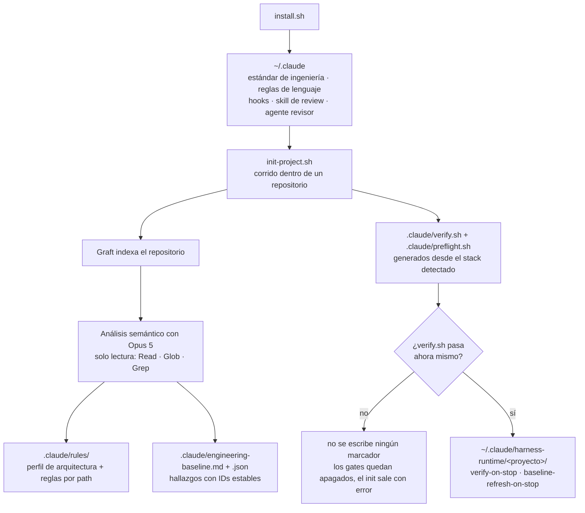
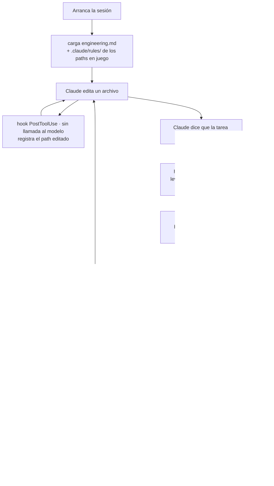
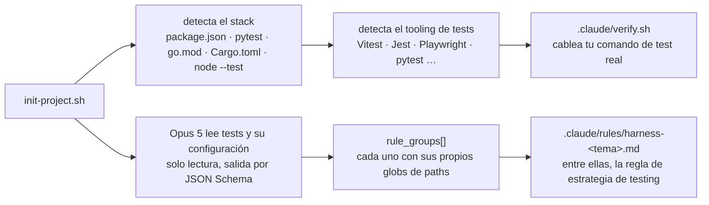
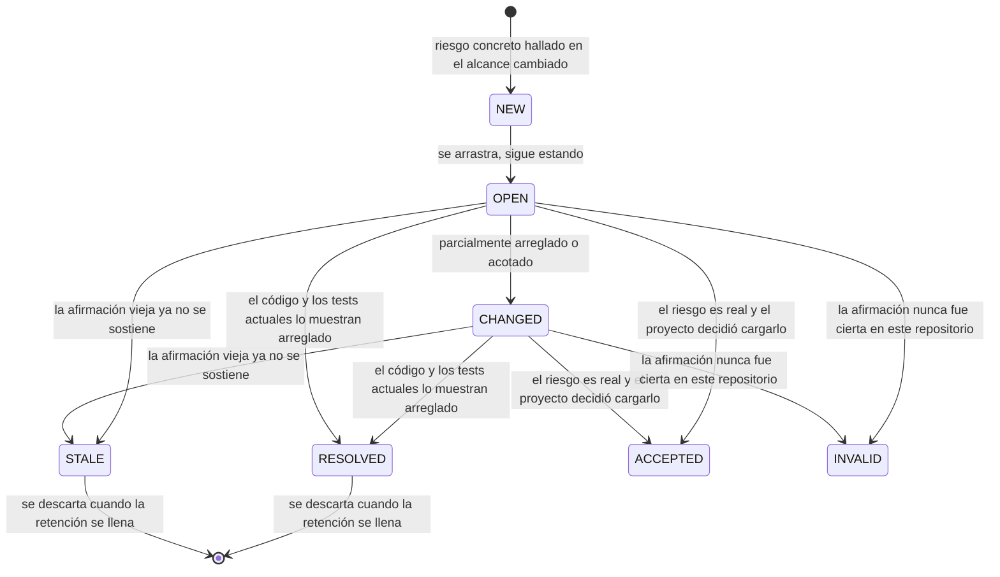

# Claude Engineering Harness

[English](README.md) · [Español](README.es.md)

### Tu agente de código deja de adivinar, deja de olvidar, y deja de decir "listo" sin pruebas.

`claude-engineering-harness` es un harness personal para Claude Code. Instala un estándar de
ingeniería fijo en cada sesión, genera reglas a partir de una lectura semántica de tu repositorio
real, condiciona el final de cada tarea a una verificación que realmente corrió, y mantiene una
línea base de riesgos conocidos que envejece con el código en lugar de quedar obsoleta.

Herramienta personal, hecha para mis propios proyectos. Se instala global en `~/.claude` y se
inicializa por repositorio.

---

## Contenido

- [Origen](#origen)
- [Frontera](#frontera)
- [Arranque rápido](#arranque-rápido)
- [Cómo funciona el harness](#cómo-funciona-el-harness)
- [Los principios de ingeniería, y por qué](#los-principios-de-ingeniería-y-por-qué)
- [Tests](#tests)
- [Qué corre y cuándo](#qué-corre-y-cuándo)
- [Para qué sirve cada archivo generado](#para-qué-sirve-cada-archivo-generado)
- [Consentimiento](#consentimiento)
- [Qué corre la verificación](#qué-corre-la-verificación)
- [Proyecto nuevo](#proyecto-nuevo)
- [Estados de la línea base](#estados-de-la-línea-base)
- [Graft y el harness](#graft-y-el-harness)
- [Estructura del repo](#estructura-del-repo)
- [Costo](#costo)
- [Respaldos](#respaldos)
- [Desinstalar](#desinstalar)

---

## Origen

La calidad del trabajo de un agente no es solo una propiedad del modelo. Es una propiedad del
harness que lo rodea: qué contexto se carga antes de que piense, qué reglas tiene delante mientras
escribe, y qué tiene que pasar antes de que se le permita decir que el trabajo está terminado. El
modelo es la parte que no podés cambiar. El harness es la parte que sí.

Librado a sí mismo, un agente de código falla de cuatro maneras, y ninguna es una falla de
inteligencia:

- **Ciego.** Vuelve a explorar el repositorio desde cero, un grep y un archivo a la vez,
  reconstruyendo una imagen que tenía hace una hora y descartó.
- **Olvidadizo.** Un riesgo encontrado el martes desapareció el miércoles. Nada persiste entre
  sesiones, así que el mismo punto débil se redescubre, o se reintroduce en silencio.
- **Sin verificar.** Termina una tarea y te dice que está lista. El lint nunca corrió. La suite de
  tests nunca corrió. El resumen suena seguro, el diff es plausible, nada lo revisó, y te enterás
  después.
- **Desactivado.** Docker estaba apagado, entonces los tests "fallaron", entonces el gate se
  volvió ruido, entonces lo apagaste. Ahora no se revisa nada.

Un ingeniero senior sostiene un estándar, recuerda qué es frágil, levanta la base de datos en vez
de culparla, y no dice haber corrido un chequeo que se salteó. El harness hace que el agente haga
lo mismo de forma mecánica, en lugar de esperar que ocurra.

Todo lo que sigue se desprende de eso. El estándar es fijo para que no se pueda discutir. Las
reglas se leen de tu repositorio para que el consejo sea específico. El gate corre comandos reales
para que "verificado" signifique algo. La línea base persiste para que la memoria sobreviva a la
sesión. Y una herramienta no disponible se reporta como condición del entorno, porque un gate que
diagnostica mal es un gate que borrás — y un gate borrado no revisa nada.

---

## Frontera

Cuatro capas, con el menor solapamiento posible.

| Capa | De qué es dueña |
|---|---|
| **Claude Code** | El runtime: el modelo, las herramientas, el sistema de hooks, la sesión. |
| **Graft** | El mapa del repositorio: símbolos, llamadores, relaciones, radio de impacto, frescura. *Dónde están las cosas y qué tocan.* |
| **Este harness** | La política de ingeniería, las reglas específicas del proyecto, la línea base viva de riesgos, y el gate de verificación. *Cómo se ve lo bueno, y si terminaste.* |
| **Tu repositorio** | El código, y los scripts que lo verifican. `verify.sh` y `preflight.sh` se generan una vez y después son tuyos para editar. |

El harness nunca escribe el código de tu aplicación ni escribe tus tests. Decide qué tiene que
saber el agente antes de escribirlos, y qué tiene que pasar después.

---

## Arranque rápido

```bash
chmod +x install.sh
./install.sh                              # estándar global, hooks, skill, agente
~/.claude/harness-tools/init-project.sh   # dentro de cada repo que quieras cubrir
```

Eso es toda la instalación. `install.sh` escribe el estándar en `~/.claude` y conecta dos hooks en
tu configuración de Claude Code. `init-project.sh` lee el repositorio, escribe reglas específicas
para él, genera la línea base y el script de verificación, y prende el gate del Stop una vez que
comprobó que la verificación funciona. Desde la sesión siguiente, el harness te acompaña.

Reiniciá Claude Code después de instalar. Volvé a correr `init-project.sh` después de actualizar
el harness: regenera los archivos del proyecto y conserva el estado de la línea base existente.

Necesita Node 20+ y npm para Graft. Git es opcional: fuera de un repositorio el inicializador usa
el directorio actual como raíz del proyecto. No se pisa nada: el instalador preserva la
configuración de Claude Code ajena y respalda cada archivo que toca en
`~/.claude/harness-backups/<timestamp>/`.

---

## Cómo funciona el harness

Dos fases. La instalación y la inicialización pasan una vez cada una; el ciclo de sesión pasa en
cada tarea, siempre.

### Instalar e inicializar



El gate solo se prende en un proyecto donde se observó que la verificación pasa al menos una vez.
Un repositorio que no puede verificarse a sí mismo nunca recibe un gate que fallaría en cada
tarea.

### El ciclo de sesión



El orden es el punto. La verificación va primero y bloquea si falla. El refresh de la línea base
va segundo y nunca bloquea: un refresh fallido no puede convertir un buen cambio en una tarea
fallida, así que reporta, sale con 0, y deja su marcador sucio para que el próximo Stop reintente.

---

## Los principios de ingeniería, y por qué

El núcleo del harness es `~/.claude/harness/engineering.md`, cargado en cada sesión en cada
directorio. Es opinado a propósito, y cada regla existe por una forma concreta en que el trabajo
sale mal.

### 1. Un orden fijo de prioridades para los tradeoffs

```text
1. Corrección
2. Seguridad e integridad de datos
3. Mantenibilidad
4. Simplicidad
5. Consistencia con la arquitectura existente
6. Performance cuando hay evidencia que la respalde
```

**Por qué.** Sin un orden declarado, cada tradeoff se vuelve a discutir desde cero y se resuelve
con lo último que se mencionó. Performance va última a propósito: es la única dimensión que un
agente ofrece sin que se la pidan, la más fácil de argumentar sin medir nada, y la excusa habitual
para una construcción ingeniosa que nadie puede mantener. Se optimiza cuando se mide, no cuando se
sospecha.

### 2. Entender antes de cambiar

Leer la implementación. Identificar llamadores, dependencias, efectos secundarios, flujo de datos.
Nunca implementar desde un nombre de archivo o una suposición.

**Por qué.** El defecto característico de un agente es un cambio plausible en la capa equivocada:
código que coincide con el nombre del archivo y no con el contrato que hay adentro. **Lo hace
cumplir** el perfil de arquitectura generado, que describe los límites reales entre módulos y la
dirección de las dependencias, y Graft, que responde "quién llama a esto" en una consulta en lugar
de diez greps.

### 3. Explícito antes que ingenioso, y el cambio coherente más chico

Responsabilidades enfocadas, dependencias explícitas, acoplamiento bajo. Sin estado global mutable
oculto. Sin abstracciones innecesarias. Nombres que comunican intención. Comentarios que registran
el *por qué*, no el qué.

**Por qué.** Un agente escribe código fluido muy rápido, lo que hace que sobre-abstraer sea barato
de producir y caro de revisar. La restricción no es cuánto código se escribe, sino cuánto tiene
que sostener una persona en la cabeza para aprobarlo.

### 4. Diseñar para la falla, no para el camino feliz

Entrada inválida, datos faltantes o viejos, fallas de servicios externos, timeouts, fallas
parciales, operaciones duplicadas, reintentos, concurrencia, condiciones de carrera, operaciones
interrumpidas. Hacer difícil de representar los estados inválidos. Acotar cada reintento y cada
espera externa. Nunca tragarse un error en silencio.

**Por qué.** El camino feliz es la parte que se demuestra, así que es la parte que se escribe.
Todo lo de esa lista es un incidente real de producción que en el diff se lee como una ausencia, y
la ausencia es justo lo que la revisión no ve.

### 5. Entrada no confiable en cada frontera

Validar en las fronteras. Autenticación no es autorización. Mínimo privilegio. Parametrizar
consultas. Nada de ejecución dinámica insegura. Nunca loguear credenciales ni payloads sensibles.
Sanear los errores que cruzan una frontera de confianza. Revisar una dependencia antes de
agregarla.

**Por qué.** Los defectos de seguridad son la clase de bug más barata de introducir y la más cara
de encontrar después, y son invisibles para una suite que solo verifica que la funcionalidad
anda. **Lo hacen cumplir** las reglas generadas con alcance de seguridad, que nombran las
fronteras reales de auth, autorización y auditoría de este repositorio en lugar de repetir la
categoría.

### 6. Escalabilidad arquitectónica antes que infraestructura

Preservar límites y contratos entre módulos. Preferir componentes sin estado. Mantener la
infraestructura reemplazable detrás de una frontera. Evitar microservicios, colas, cachés y
coordinación distribuida innecesarios. Optimizar cuellos de botella medidos.

**Por qué.** Agregar infraestructura es la respuesta más fácil de decir ante una pregunta de
escala, y la de mayor costo operativo permanente. Una cola introducida especulativamente es un
modo de falla nuevo, un despliegue nuevo, y una cosa nueva para debuggear a las 3 de la mañana.

### 7. Disciplina de alcance

Sin refactors ajenos. Sin abstracciones especulativas. Sin rediseñar arquitectura que funciona sin
una razón concreta. Sin dependencias para algo que la plataforma ya hace. Un diff revisable.

**Por qué.** El desborde de alcance es donde el trabajo del agente se degrada más rápido: el fix
pedido está bien y los diecisiete archivos alrededor quedaron sin revisar. Un diff que nadie lee
es un diff donde nadie encontró nada.

### 8. Testear el riesgo, no la forma

Cubierto completo en [Tests](#tests).

### 9. La línea base es orientativa, no autoritativa

`.claude/engineering-baseline.md` es una foto viva. Antes de actuar sobre un hallazgo, verificalo
contra el código y los tests actuales; ante un conflicto, gana la evidencia de la implementación
actual sobre el hallazgo viejo.

**Por qué.** Memoria persistente que se cree ciegamente es peor que no tener memoria. Un hallazgo
escrito hace tres semanas puede estar ya arreglado, y un agente que lo "repara" va a dañar código
que funciona con total seguridad, citando al harness como fuente.

### 10. Una herramienta no disponible es una condición del entorno, no un defecto

Exit `3` (nada para verificar) y exit `127` (comando faltante) se reportan con su remedio y no
bloquean. Cualquier otra cosa significa que los chequeos corrieron y algo está mal, y eso bloquea.

**Por qué.** Esta es la regla que mantiene el gate instalado. Si a alguien le dicen "corregí los
errores de verificación" en cada Stop porque Docker no está corriendo, sin ninguna edición que
pueda destrabarlo, borra el gate — y entonces no se revisa nada. Antes de culpar al entorno, el
preflight intenta levantarlo; y nunca resetea ni borra una base de datos local para recuperarse de
un arranque fallido: se detiene y reporta.

### 11. Terminar con honestidad

Inspeccionar el diff final. Correr el chequeo de formato, lint, chequeo de tipos, los tests
relevantes y el build. Después revisar el diff como si lo hubiera escrito otra persona y vos
tuvieras que aprobarlo para producción. Si un paso no pudo correr, decir exactamente qué quedó sin
verificar y por qué. Nunca declarar verificado un cambio cuyos chequeos no corrieron.

**Por qué.** Esta es la falla por la que existe todo el harness, y es la única regla que no se
puede hacer cumplir pidiéndola. **La hace cumplir** el hook Stop, que corre los comandos él mismo
y sale con 2 si fallan. Una afirmación en el resumen no es evidencia; un código de salida sí.

### 12. Reportar un cambio terminado nombrando los tests

Nombrar cada test agregado o modificado y decir qué fija cada uno. Decir claramente cuando un
comportamiento no está cubierto por ningún test. Donde se escribió un test de regresión, indicar
que se comprobó que falla antes del fix. Los números, al final.

**Por qué.** "Pasan los 240 tests" es cierto exactamente igual esté o no cubierto el
comportamiento nuevo, así que no dice nada sobre el cambio que te piden confiar. La lista sí; el
número es contexto de la lista, nunca su reemplazo.

### 13. Una unidad de trabajo, una rama, un merge commit

Ramificar como `<tipo>/<slug-kebab>` con el vocabulario de Conventional Commits, mantener la rama
viva horas y no días, y mergearla con un merge commit — nunca squash, nunca rebase-merge. La
convención del propio repositorio gana donde exista.

**Por qué.** De esto se siguen dos cosas, y solo una es cosmética. La cosmética es un historial
legible: el merge commit es lo que dibuja la burbuja en el gráfico, y una rama llamada `perf/` al
lado de un commit tipado `perf(worker):` dice qué fue un cambio sin abrirlo — con squash en todo,
el gráfico es una línea recta que no registra nada sobre cómo se dividió el trabajo. La que
importa es que el pull request es donde corren los checks. Un trigger `pull_request:` en CI no
vale nada en un repositorio donde todo se pushea a la rama por defecto: el job existe, figura en
verde en la página de settings, y nunca corrió una sola vez antes de un merge. Pushear a `main` no
es más rápido que abrir un PR, solo mueve la falla a después del hecho.

Preparar un repositorio para esto es un comando, una sola vez:

```bash
gh repo edit --enable-squash-merge=false --enable-rebase-merge=false \
             --enable-merge-commit --delete-branch-on-merge
```

El harness se detiene ahí a propósito. No hay job de CI que valide el nombre de rama ni branch
protection en el estándar, porque ambas cosas son formas de vigilar una convención en lugar de
seguirla, y un repositorio que necesita ser forzado a esta forma tiene un problema de personas que
el harness no puede arreglar.

El instalador además fija el modelo y el esfuerzo con el que corre este trabajo:

```text
Modelo:   claude-opus-5
Esfuerzo: high
```

---

## Tests

La palabra cubre tres cosas distintas acá, así que conviene separarlas: qué hace el harness que el
agente *escriba*, qué *corre*, y qué demuestra sobre *sí mismo*.

### 1. El harness no escribe tus tests. Restringe cómo se escriben.

Acá no hay un generador de tests, y es deliberado: un test escrito por la misma pasada que escribió
el código tiende a afirmar lo que el código hace en vez de lo que debería hacer, y pasa antes y
después del bug. Lo que el harness trae en su lugar es política que se carga sola en el momento en
que Claude abre un archivo de test.

`~/.claude/rules/harness-tests.md` declara su propio alcance en el frontmatter:

```yaml
paths:
  - "**/*.test.*"
  - "**/*.spec.*"
  - "**/test/**"
  - "**/tests/**"
```

Claude Code la carga solo para archivos que coinciden con esos globs, así que no cuesta nada en
una sesión que no toca tests. Lo que exige:

- Testear comportamiento e invariantes con significado externo, no detalles de implementación.
- Mantener los tests deterministas e independientes del orden de ejecución.
- Evitar sleeps arbitrarios y aserciones sensibles al tiempo cuando hay sincronización
  determinista posible.
- Nombrar cada test por el comportamiento o el riesgo que protege.
- Preferir fixtures y builders enfocados antes que bloques de setup grandes y opacos.
- **Un test de regresión debe fallar con el bug original y pasar con el fix.**
- No mockear la unidad bajo prueba. Mockear fronteras externas solo cuando mejora el determinismo
  sin ocultar el comportamiento que se está validando.
- Nunca debilitar ni borrar un test válido para que un cambio pase.

El estándar global agrega el orden de riesgo — reglas de negocio, casos borde, caminos de falla,
regresiones, concurrencia, integraciones importantes — más dos reglas que pesan más de lo que
parecen: no perseguir un número de cobertura sin una razón basada en riesgo, y **un test nuevo
tiene que demostrarse fallando contra el código sin arreglar.** Un test que pasa antes y después
es peor que no tener test, porque reporta una cobertura que no existe.

### 2. Cómo se generan las reglas de test específicas del proyecto

El consejo genérico sobre tests es casi inútil: el agente ya sabe que los tests deben ser
deterministas. Lo que no sabe es *cómo testea este repositorio*. Esa parte se lee del repositorio
durante `init-project.sh`:



El prompt de análisis nombra "tests y configuración de tests" entre las cosas que debe inspeccionar,
y declara el objetivo explícitamente: los agentes futuros deben **escribir tests acordes a la
estrategia de testing del repositorio**. La salida se fuerza por un JSON Schema — de 2 a 8
`rule_groups` enfocados, cada uno declarando los globs relativos al repositorio a los que aplica —
así que la regla de testing aterriza acotada a tus paths de test en vez de quedar como prosa
dentro de un muro de consejos generales. Dos restricciones la mantienen honesta:

- **Verificar las afirmaciones contra el código.** El prompt prohíbe inventar convenciones, y cada
  regla debe ser lo bastante específica como para cambiar una decisión de implementación en este
  repositorio.
- **No repetir el estándar global.** Todo lo que ya cubre `engineering.md` queda excluido, así que
  la regla generada es solo lo que es cierto *acá*.

Como la salida del modelo llega a nombres de archivo y globs de paths, se trata como entrada no
confiable: cada path pasa por saneadores de path y de glob, y los cuerpos de las reglas también se
sanean — estos archivos se cargan como instrucciones en cada sesión futura.

### 3. Qué corre el harness

La verificación ejecuta el comando de test que ya tenés, a través del gestor de paquetes que
indica tu lockfile. No inventa uno, y no trata tu suite como opcional.

| Stack | El paso de test en el `verify.sh` generado |
|---|---|
| `package.json` | tu script `test`; `typecheck` cae a `test:types`; un monorepo pnpm cae a `pnpm -r --if-present run` |
| Python | `pytest`, si está instalado |
| `go.mod` | `go test ./...` |
| `Cargo.toml` | `cargo test` |
| `*.test.mjs` sin manifiesto | `node --test`, para un repositorio que no lleva `package.json` por diseño |
| ninguno de esos | un stub que sale con 3 y te pide personalizarlo, en vez de fingir que verifica |

Los pasos que no tenés se saltean, no se simulan. Un proyecto con solo `lint` y `test` corre
exactamente esos dos. La verificación corre de lo más barato a lo más caro y para en la primera
falla, así que un error de formato no te cuesta un build completo.

### 4. Qué demuestra el harness sobre sí mismo

Este repositorio es el harness, así que un defecto acá no rompe un proyecto: rompe todos los
proyectos donde el harness está instalado, en silencio, porque la mayoría de los modos de falla son
"un chequeo que nunca corrió" y no "un chequeo que falló". Dos comentarios publicados afirmaron
durante meses que cierto archivo de tests verificaba algo, mientras el archivo no existía.

Por eso la suite testea los scripts como subprocesos reales contra un `HOME` descartable, porque el
riesgo que cargan es lo que le hacen a un archivo de configuración real en un disco real.
**175 tests en 14 archivos**, sin dependencias, sin nada más que Node 20+:

```bash
node --test tests/*.test.mjs
```

| Archivo | Qué fija |
|---|---|
| `consent.test.mjs` | un repositorio clonado no puede prender el gate del Stop por sí mismo, su `verify.sh` y su `preflight.sh` no se ejecutan, y ningún hook publicado se habilita desde un path que controla el repositorio |
| `payload.test.mjs` | un archivo agregado a cualquier directorio del payload realmente se instala *y* realmente se desinstala, y el payload de fábrica va y vuelve sin dejar nada |
| `settings.test.mjs` | install aplica los defaults y los dos hooks, es idempotente, y deja intactos los settings ajenos y los hooks de terceros |
| `hooks.test.mjs` | la lista de casos del PostToolUse y el filtro grep del refresh coinciden en todos los paths, y la contabilidad interna del harness se ignora mientras el código fuente real se registra |
| `init-project.test.mjs` | el `verify.sh` generado es un script usable, un script e2e que el repositorio declara entra al gate, y un proyecto sin scripts utilizables falla fuerte en vez de verificar nada |
| `render.test.mjs` | los renderers rechazan salida del modelo sin estructura o incompleta, los paths con escapes nunca llegan a las líneas de evidencia, y una reinicialización conserva los IDs de hallazgo y las decisiones registradas sobre ellos |
| `schemas.test.mjs` | los dos JSON Schemas parsean, sobreviven al stripping de saltos de línea que aplican sus llamadores, son objetos cerrados, solo piden claves que algún renderer realmente lee, y no ofrecen ningún estado de hallazgo que el renderer no sepa archivar |
| `baseline-refresh-trigger.test.mjs` | una edición hecha por Bash igual llega al refresh, mientras que un árbol limpio y un árbol sucio ya analizado siguen sin costar una llamada al modelo |
| `graft-evidence.test.mjs` | un grafo que no responde nada no se reporta como una integración exitosa |
| `stream-progress.test.mjs` | el progreso va solo a stderr, y un stream que termina sin evento de resultado es un error en vez de un análisis parcial renderizado como completo |
| `rules.test.mjs` | cada regla publicada está nombrada de forma que uninstall la remueve, y cada regla declara los paths a los que aplica |
| `defaults.test.mjs` | el snippet de settings para copiar a mano aplica exactamente lo que aplica el instalador, y no promete nada más |
| `version.test.mjs` | `VERSION` es la única fuente del número de release, y ningún script publicado lo repite en prosa |
| `severity.test.mjs` | la tabla de severidad está fijada celda por celda, y el veredicto de "carried" lee la calificación computada y no una provista |

CI corre la suite en Node 20, 22 y 24, en Linux y macOS, lintea cada script de shell con un
shellcheck pineado, y corre un job bajo el `/bin/bash` 3.2 real — porque las dos regresiones de
shell más recientes fueron solo de macOS y una de ellas pasó `bash -n` en la máquina que la
publicó.

---

## Qué corre y cuándo

Cuatro cosas se disparan solas. Nada más hay que correr a mano.

**PostToolUse** se dispara con `Write`, `Edit`, `MultiEdit` y `NotebookEdit`, y registra paths
relativos al repositorio en `~/.claude/harness-runtime/<proyecto>/`. No llama al modelo y no toca
código. Existe para que el refresh sepa el radio de impacto sin adivinar. Ignora su propia
contabilidad: ediciones a los archivos de línea base, a `.claude/rules/`, a `verify.sh`, y a
`graft/`, `node_modules/`, `dist/`, `build/` y `coverage/` nunca marcan el proyecto como sucio.

Ese registro es una de dos fuentes, no la única. Claude Code no dispara PostToolUse cuando un
archivo se escribe por Bash — un heredoc, `sed -i`, un one-liner de python — así que una tarea que
edita así lo deja vacío. Git sí ve esas ediciones, por eso el refresh lee las dos fuentes y analiza
la que tenga contenido. Un árbol de trabajo que queda sucio entre turnos se identifica por huella
después del filtro de ignorados, así que la fuente git no cuesta nada cuando nada se movió.

**El hook Stop** corre primero verify y después refresh. Una verificación fallida bloquea la
tarea. Un refresh fallido es fail-soft, y el estado sucio se conserva para que el próximo Stop
reintente.

También distingue un cambio roto de un chequeo que no pudo correr. Exit `3` (no aplica ninguna
estrategia de verificación) y exit `127` (falta un comando requerido) son condiciones del entorno:
se reportan en cada Stop, con el comando para resolverlas, y no bloquean. Cualquier otra cosa
significa que los chequeos corrieron y algo está genuinamente mal.

Una sesión que verificablemente no cambió nada saltea la verificación. "No cambió nada" significa
árbol de trabajo limpio y ninguna edición registrada: una tarea que edita archivos y después los
commitea deja el árbol limpio, y se verifica igual.

**El preflight** revisa si Docker está instalado pero apagado, si existe `supabase/config.toml` con
el stack caído, y si el repo realmente referencia Docker Compose — en `package.json`, bajo
`scripts/`, o en un `*.sh` o `Makefile` de la raíz. Las dos esperas son acotadas y
configurables:

```bash
HARNESS_DOCKER_WAIT_SECONDS=120
HARNESS_SUPABASE_WAIT_SECONDS=180
HARNESS_AUTO_INFRA=0 .claude/verify.sh   # solo chequea, no levanta nada
```

Nunca resetea ni borra una base de datos local para recuperarse de un arranque fallido. Se detiene
y reporta el problema del entorno.

`init-project.sh` es un comando de una sola pasada, así que registra qué levantó el preflight y lo
baja después, dejando la máquina como la encontró; un stack que ya estaba corriendo no se toca
nunca. El gate del Stop deliberadamente lo deja arriba — reiniciar Supabase antes de cada tarea
costaría mucho más de lo que vale el gate — y lo dice, imprimiendo el comando para bajarlo.

**El refresh** le pasa a Opus 5 la línea base estructurada actual más el contexto de impacto de
Graft, restringido a `Read`, `Glob` y `Grep`. No puede editar. Se le piden dos cosas y nada más:
revalidar los hallazgos que el cambio pudo plausiblemente afectar, y señalar riesgos nuevos
concretos dentro del radio de impacto.

Tanto el refresh como el análisis inicial corren con tu repositorio como directorio de trabajo, así
que ninguno de los dos puede ver `~/.claude` — que es donde viven de verdad todos los hooks,
marcadores y settings del harness. Si el harness está instalado o corriendo queda entonces fuera de
alcance para ellos, y los dos prompts lo dicen. La ausencia de los marcadores `.claude/verify-on-stop`
en particular no es evidencia de nada: el harness los borra a propósito, porque un marcador dentro
del repo dejaba que un clon se autorizara a sí mismo a correr su propio `verify.sh`.
`.claude/verify.sh` y `.claude/preflight.sh` siguen siendo terreno válido por lo que hacen, o dejan
de hacer, para tu repositorio.

Cada llamada al modelo que el harness hace por script es de solo lectura y no persistente:
`--safe-mode --tools "Read,Glob,Grep" --disallowedTools "mcp__*" --permission-mode dontAsk
--no-session-persistence`, con un JSON Schema sobre la salida. El harness lee repositorios; nunca
deja que una llamada por script escriba uno.

---

## Para qué sirve cada archivo generado

### En tu repositorio

Escritos por `init-project.sh`, salvo donde se indique.

| Archivo | Qué es |
|---|---|
| `CLAUDE.md` | Las instrucciones de tu proyecto. El harness actualiza solo su propio bloque gestionado y preserva todo lo demás que escribiste. |
| `.claude/rules/project-architecture.md` | El perfil de arquitectura que escribió Opus después de leer tu repositorio: módulos, fronteras, flujo de datos, invariantes. Este es el archivo que hace que el consejo sea específico en vez de genérico. |
| `.claude/rules/harness-*.md` | Reglas condicionales que se cargan solo para paths que coinciden. Integridad del backend, fronteras de seguridad, estrategia de testing, y lo que el análisis haya juzgado que este repo necesita. |
| `.claude/engineering-baseline.md` | La lista legible de riesgos de ingeniería conocidos, cada uno con un ID estable y un estado. Este es el archivo que leés vos. La retención está limitada a 20 hallazgos activos, 10 cargados y 15 resueltos/obsoletos, descartando primero los de menor severidad, para que siga valiendo la pena leerlo. |
| `.claude/engineering-baseline.json` | Los mismos hallazgos como estado de máquina. Existe para que un hallazgo conserve su identidad entre refreshes en vez de reescribirse como uno nuevo cada vez. |
| `.claude/verify.sh` | El comando de verificación de este proyecto, generado desde el stack detectado. Editalo libremente: es tuyo. |
| `.claude/preflight.sh` | Levanta la infraestructura local antes de que la verificación juzgue nada. Se genera solo si no tenés uno; un preflight propio nunca se sobrescribe, pero no se ejecuta hasta que lo apruebes — ver [Consentimiento](#consentimiento). |
| `.claude/auto-compose` | Opcional, lo creás vos. Su presencia le dice al preflight que levante Docker Compose en un repo que de otro modo no lo referencia. |
| `.claude/settings.json` | Configuración de Claude Code a nivel proyecto. |
| `.mcp.json`, `.claude/skills/graft/`, `.claude/helpers/` | Escritos por `graft init`, no por el harness. El harness los respalda primero y después deja que Graft sea su dueño. |

Los dos marcadores que habilitan los gates **no** están en el repositorio. Viven en
`~/.claude/harness-runtime/<proyecto>/`, escritos solo por `init-project.sh` y solo después de que
ese paso se probó funcionando una vez. Ver [Consentimiento](#consentimiento).

### Globales, en `~/.claude`

| Archivo | Qué es |
|---|---|
| `harness/engineering.md` | El estándar de ingeniería en sí. El archivo más importante del repo. |
| `harness/project-analysis-prompt.md` + `.json` | El prompt y el JSON Schema del análisis inicial del repositorio. El schema es lo que fuerza salida estructurada en vez de prosa. |
| `harness/baseline-refresh-prompt.md` + `.json` | El mismo par para el refresh incremental. |
| `harness/project-template/` | Los esqueletos de `CLAUDE.md`, `verify.sh`, `preflight.sh` y la regla de arquitectura que `init-project.sh` copia y completa. |
| `rules/harness-*.md` | Reglas que se cargan automáticamente para paths que coinciden, en cualquier proyecto: `typescript`, `react`, `tests`, `sql`, `http-api`, `jobs`, `config`, `shell`, `docker`, `ci`. Cada una declara sus propios globs, así que nada se carga donde no aplica. |
| `skills/harness-engineering-review/SKILL.md` | La skill de review: una pasada de production-readiness sobre corrección, seguridad, mantenibilidad, escalabilidad y calidad de tests. |
| `agents/harness-engineering-code-reviewer.md` | Un agente revisor de solo lectura que no puede editar, para una segunda opinión independiente sobre un cambio terminado. |
| `hooks/mark-baseline-dirty.sh` | El hook PostToolUse. Registra archivos editados, no llama al modelo. |
| `hooks/verify-project.sh` | El hook Stop. Corre preflight, verificación y después refresh. |
| `harness-tools/` | `init-project.sh` y `refresh-baseline.sh`, más los renderers que convierten la salida estructurada del modelo en Markdown, el reporter de progreso que hace observable el análisis mientras corre, y los helpers de settings que usan install y uninstall. |
| `harness-runtime/<proyecto>/` | Estado sucio por proyecto, escrito por el hook PostToolUse y consumido por el refresh. Descartable. |
| `harness-state.json` | El `model` y el `effortLevel` que tenía tu `settings.json` antes de la primera instalación, para que uninstall pueda devolverlos. Se escribe una vez, nunca lo pisa una reinstalación, y uninstall lo borra. |

---

## Consentimiento

Los hooks se instalan globalmente, así que se disparan en cada repositorio que abrís — incluido
uno que acabás de clonar. Dos pasos del harness ejecutan scripts que viven en el repositorio: el
gate del Stop corre `.claude/verify.sh`, y la inicialización corre `.claude/preflight.sh`.

Entonces el permiso para correrlos no puede venir del repositorio. Y no viene:

| Decisión | Dónde vive | Quién puede escribirla |
|---|---|---|
| ¿El gate del Stop está prendido para este proyecto? | `~/.claude/harness-runtime/<proyecto>/verify-on-stop` | `init-project.sh`, después de que la verificación pasó una vez |
| ¿El refresh de la línea base está prendido? | `~/.claude/harness-runtime/<proyecto>/baseline-refresh-on-stop` | lo mismo |
| ¿Puede correr el `preflight.sh` propio de este repositorio? | `~/.claude/harness-runtime/<proyecto>/preflight-approved` | vos, con `--trust-preflight` |

Qué significa en la práctica:

```bash
git clone https://github.com/alguien/su-proyecto
cd su-proyecto && claude          # preguntá lo que quieras: ningún script suyo del harness corre
```

Nada de ellos se ejecuta, porque nunca habilitaste nada para ese proyecto. Corré `init-project.sh`
ahí y el harness regenera `verify.sh` desde el stack que detecta, en vez de adoptar el de ellos.

Un `preflight.sh` es el único archivo que el harness no sobrescribe, porque puede ser genuinamente
tuyo. Si no lo generó el harness, la inicialización conserva su contenido y le saca el bit de
ejecución, que es lo que todo camino de ejecución verifica, y te avisa:

```
Preserved custom .claude/preflight.sh, but did NOT enable it.
  Read /path/to/.claude/preflight.sh, then approve it with:
    ~/.claude/harness-tools/init-project.sh --trust-preflight
```

La aprobación registra ese archivo exacto. Editalo — o dejá que un `git pull` lo cambie — y hay
que aprobarlo de nuevo.

**Actualización:** los proyectos inicializados antes de esto usaban marcadores dentro del
repositorio. Ya no se honran. El hook Stop lo dice y nombra el arreglo; volvé a correr
`init-project.sh` en cada proyecto para volver a otorgarlo.

**Qué no cubre esto:** una vez que adoptaste un repositorio, su `verify.sh` es un script que corrés
vos, y un `git pull` posterior puede cambiarlo. Es la misma confianza que le extendés a un
`Makefile` o a un script de `package.json` — el harness no agrega una segunda capa encima.

---

## Qué corre la verificación

`init-project.sh` escribe `.claude/verify.sh` a partir del stack que encuentra:

| Detectado | Qué corre el script generado |
|---|---|
| `package.json` | Tus scripts reales, con el gestor de paquetes que indica tu lockfile. Un monorepo pnpm cae a `pnpm -r --if-present run` sobre lint, typecheck, test, build y los scripts e2e. |
| Python | `ruff check`, `mypy`, `pytest` — los que estén instalados. |
| `go.mod` | `go vet ./...`, `go test ./...` |
| `Cargo.toml` | `cargo fmt --check`, `cargo clippy --all-targets --all-features -- -D warnings`, `cargo test` |
| `*.test.mjs` sin manifiesto | `node --test`. Se evalúa después de los manifiestos de arriba, así un repositorio que lleve ambos se verifica como el stack que declara. |
| ninguno de esos | Un stub que sale con 3 y te pide personalizarlo, en vez de fingir que verifica. |

Independientemente del stack, un repositorio con `Dockerfile` también se lintea con hadolint antes
de los chequeos del stack. Dos decisiones mantienen ese gate usable en vez de molesto:

- **Un hadolint faltante reporta y sigue.** Una herramienta no disponible no es un defecto de
  código, y hacer fallar el build por eso es exactamente cómo se termina apagando un gate.
- **Falla en `warning` y arriba, no en el `info` por defecto de hadolint.** El default hace fallar
  un Dockerfile perfectamente correcto por notas informativas. Los warnings igual atrapan lo que
  importa: una imagen base `latest`, versiones de apt sin pinear. Se ajusta con
  `HARNESS_HADOLINT_THRESHOLD`.

Para un proyecto Node corre los chequeos más fuertes que ya tenés, de lo más barato y no mutante
primero, parando en la primera falla:

```text
fmt:check       formato
format:check    formato, nombre alternativo del script
lint            análisis estático
typecheck       cae a test:types
test            tu suite
build           el más caro
test:e2e        tu suite end-to-end, última: casi siempre necesita el build
```

Cada uno se saltea si `package.json` no tiene ese script. No se inventa nada y no se adivina nada.
Un proyecto con solo `lint` y `test` corre exactamente esos dos.

Cuando no se detecta nada, el stub falla ruidosamente en vez de pasar. Es deliberado. Verificar
nada en silencio es peor que decir que no se puede.

---

## Proyecto nuevo

`init-project.sh` analiza un repositorio y depende de poder verificarlo, así que necesita algo que
analizar. En un directorio vacío se degrada con honestidad en vez de fingir:

1. Graft construye un grafo casi vacío, y el análisis semántico casi no tiene nada que describir.
2. No se detecta stack, así que `verify.sh` es el stub que sale con 3.
3. La verificación falla, así que **no se escribe ningún marcador**: el gate del Stop y la línea
   base viva quedan apagados.
4. El inicializador sale con código distinto de cero, diciéndote exactamente eso.

Ese es el diseño funcionando. Un repositorio donde la verificación no puede pasar nunca recibe un
gate que fallaría en cada tarea.

**No necesitás nada de eso para empezar.** El estándar, las reglas de lenguaje, la skill de review
y el agente revisor son globales: `install.sh` los pone en `~/.claude` y aplican a cada sesión en
cada directorio, inicializado o no. Un proyecto recién creado ya recibe el estándar de ingeniería
desde el primer prompt.

La secuencia que funciona:

```bash
./install.sh                              # una vez en la vida
# ... armás el proyecto: package.json, scripts, un test que pase ...
git init && git add -A && git commit -m "initial"
~/.claude/harness-tools/init-project.sh   # ahora hay algo que analizar
```

Correlo cuando el proyecto tenga un script `test` o `lint` que pase y suficiente código para
describir. Antes de ese punto la capa de proyecto no tiene nada que decir, y la capa global ya te
está cubriendo.

Si igual querés los archivos del proyecto en su lugar temprano, `--skip-verify` configura todo y
deja los gates apagados por diseño. Volvé a correrlo sin esa bandera cuando el proyecto pueda
verificarse solo.

---

## Estados de la línea base

Los hallazgos reciben IDs estables — `F001`, `F002`, `F003` — y un estado que se mueve a medida
que se mueve el código.



`INVALID` es el que cierra un falso positivo. `RESOLVED` significa que era cierto y se arregló;
`STALE`, que era cierto y el terreno se movió; `ACCEPTED`, que es cierto y el proyecto decidió
cargarlo. Sin una cuarta palabra, un hallazgo que el análisis simplemente erró no tenía a dónde ir
más que quedarse abierto para siempre — y una lista de hallazgos que nadie puede corregir es una
lista que nadie lee. Un hallazgo retirado se conserva en vez de borrarse, con qué erró la
afirmación original, para que un análisis posterior no vuelva a presentar el mismo falso positivo.

Los IDs estables sobreviven una reinicialización completa, no solo un refresh. Un hallazgo se
empareja con la línea base anterior por título y conserva su número, los nuevos salen de un contador
persistido para que un número que la retención retiró nunca se le entregue a otro hallazgo, y
`ACCEPTED` e `INVALID` sobreviven la corrida: registran un juicio que ningún análisis puede volver a
derivar leyendo el código.

```text
Antes
[OPEN] HIGH — El endpoint de health devuelve 200 estando degradado · F001

Después de un fix verificado
[RESOLVED] HIGH — El endpoint de health devuelve 200 estando degradado · F001
```

### La calificación se calcula, no se pide

El modelo no elige `CRITICAL` ni `LOW`. Reporta tres hechos y el harness deriva el nivel de una
tabla, así el mismo hallazgo califica igual en cada corrida y la calificación de dos proyectos
significa lo mismo.

| Eje | Valores |
|---|---|
| `impact` | `data_loss` · `security` · `incorrect_result` · `maintenance` · `cosmetic` |
| `trigger` | `already_occurring` · `normal_use` · `specific_conditions` · `hypothetical` |
| `blast_radius` | `system_wide` (sube un nivel) · `component` · `local` (baja uno) |

`trigger` habla del daño, no del code path: una instalación global con `@latest` corre siempre,
pero el daño necesita que se publique una versión mala, así que es `hypothetical`. Solo la tabla
produce un `critical`; el modificador de alcance nunca puede crear uno, o un harness que es
system-wide por naturaleza inflaría al nivel máximo cada riesgo latente que tiene.

Cada hallazgo renderizado lleva los ejes con los que se calificó, así podés discutir con los datos
en vez de con el veredicto, y un hallazgo cuyos ejes nunca llegaron dice `NOT MEASURED`, no `LOW`.

También lleva un ejemplo concreto: una corrida que termina mal, con un actor con nombre, el paso que
falla y el estado incorrecto en que queda el sistema. Los ejes dicen qué tan grave sería la
consecuencia, nunca qué es lo que sale mal, y con sólo una severidad no hay manera de decidir que un
hallazgo no vale la pena. El ejemplo es lo que lo vuelve discutible. Un hallazgo que llegó sin uno
se renderiza como `**Example.** Not provided.` en vez de leerse como si el mecanismo fuera obvio.

### Real, y no vale el arreglo

Los ejes miden el daño. Ninguno pregunta cuánto cuesta arreglarlo, así que una debilidad real pero
trivial que exige un refactor transversal se imprimía igual que un bug de una línea — y un modelo al
que le piden buscar riesgos llena los diez lugares que le dan. Los hallazgos que valían la pena
perdían su señal entre los que nadie iba a tocar nunca.

Por eso los hallazgos reportan un cuarto dato, y el harness lo cruza con la calificación:

| `fix_cost` | Qué significa |
|---|---|
| `single_site` | Un archivo, un call site |
| `contained` | Un módulo, tres archivos como máximo, sin cruzar ninguna frontera |
| `invasive` | Cruza una frontera documentada, cambia un contrato público o un formato publicado, o revierte una política deliberada |

Un hallazgo `low` cuyo arreglo es contained o invasive, y uno `medium` cuyo arreglo es invasive,
quedan archivados bajo **Carried findings — not worth the fix**. Todo lo que esté en `high` o más
arriba sigue siendo trabajo activo a cualquier costo: el daño manda, y el cruce sólo degrada la cola.

Los hallazgos cargados quedan registrados, no borrados — con un conteo, porque una corrida que
encontró diez cosas y cargó ocho es un resultado distinto de una que encontró dos. Tienen su propio
presupuesto de retención de 10 en vez de competir por los 20 lugares activos, que es justamente el
amontonamiento que el cruce viene a terminar. Un hallazgo cuyo costo de arreglo nunca llegó sigue
siendo trabajo activo: nada se degrada por un dato que nadie aportó. Volvé a uno cuando estés
cambiando esa zona igual, o cuando nueva evidencia suba su calificación.

Los prompts también dicen que una lista vacía de hallazgos es una respuesta válida, y que de cero a
tres es el resultado normal. Decirle a un modelo que no invente hallazgos no es lo mismo que decirle
que no encontrar nada está permitido, y sólo la primera mitad estaba escrita.

`ACCEPTED` existe para que un riesgo que decidiste cargar quede registrado como decisión, en lugar
de expresarse desinflando los ejes en silencio. La calificación dice el riesgo; el estado dice la
decisión.


La identidad es el punto. Los hallazgos viven en un JSON al lado del Markdown justamente para que
`F001` siga siendo `F001` entre refreshes, en vez de reescribirse como un hallazgo nuevo cada vez
y perder el hecho de que ya lo miraste.

La línea base es orientativa, no autoritativa. El estándar le dice a Claude que verifique un
hallazgo contra el código y los tests actuales antes de actuar sobre él, porque un hallazgo escrito
hace tres semanas puede estar ya arreglado.

El refresh mantiene hallazgos, no el modelo de arquitectura. Si Opus determina que una tarea cambió
materialmente la arquitectura, la línea base registra `Full harness reanalysis recommended` y
volvés a correr `init-project.sh`. Esa separación es la razón por la que una feature común nunca
paga un análisis completo del repositorio.

La ausencia nunca se renderiza como un default favorable. Una dimensión que no se midió dice "no
medida", y si un truncamiento, un tope o un paso salteado cambiaron lo que el modelo vio, el
artefacto lo dice: una corrida degradada no puede leerse como una corrida fundamentada.

---

## Graft y el harness

Dos capas, sin solapamiento:

```text
Graft                        Harness
  mapa del repositorio         política de ingeniería
  símbolos                     reglas específicas del proyecto
  llamadores                   invariantes de negocio
  relaciones                   hallazgos vivos
  radio de impacto             verificación
  frescura
```

Graft responde *dónde están las cosas y qué tocan*. El harness decide *cómo se ve lo bueno y si
terminaste*. Claude Code usa las dos.

La evidencia de Graft acelera la navegación. Las decisiones críticas de seguridad, corrección,
reglas de negocio y mutación igual se verifican contra el código fuente — el estándar lo dice
explícitamente.

La integración reporta la evidencia que realmente obtuvo, no el hecho de que el cableado corrió: el
estado es `indexed` o `wired-but-empty`, y tanto el prompt del análisis como el resumen de la
corrida dicen si el mapa del repositorio estaba vacío y cuántas consultas estructurales devolvieron
algo. Un análisis sin fundamento no puede leerse como uno fundamentado.

Al instalar y al inicializar un proyecto, el harness le pregunta a npm si hay un Graft más nuevo y
actualiza solo cuando el registry está adelante. No va a bajar de versión un build local que sea
más nuevo que el latest de npm.

---

## Estructura del repo

```text
install.sh                     instalación global: payload, hooks, defaults de settings
uninstall.sh                   el inverso exacto, derivado del mismo árbol
VERSION                        única fuente del número de release

src/
├── harness/                   engineering.md + los dos pares prompt/schema
├── rules/                     reglas harness-*.md de lenguaje y de área
├── hooks/                     mark-baseline-dirty.sh · verify-project.sh
├── skills/                    harness-engineering-review
└── agents/                    harness-engineering-code-reviewer

project-template/              CLAUDE.md · verify.sh · preflight.sh · regla de arquitectura
tools/                         init-project.sh · refresh-baseline.sh · renderers · I/O de settings
tests/                         175 tests, node:test, sin dependencias
```

`src/`, `project-template/` y `tools/` son el payload instalable. Tanto `install.sh` como
`uninstall.sh` derivan lo que tocan del árbol y no de una lista hardcodeada, y
`tests/payload.test.mjs` lo demuestra agregando un archivo a cada directorio del payload y haciendo
que vaya y vuelva — un archivo commiteado, revisado y documentado pero que en silencio nunca se
copia es un modo de falla que este repositorio realmente tuvo.

No hay dependencias, ni `package.json`, ni lockfile. Las herramientas Node son ESM `.mjs` usando
solo builtins `node:`; el shell es POSIX y compatible con Bash 3.2, porque macOS todavía trae
`/bin/bash` 3.2. El harness se instala en un directorio home: todo lo que necesite en runtime tiene
que estar ya en la máquina.

---

## Costo

`init-project.sh` es la llamada cara. Lee el repositorio en profundidad, una vez.

Después de eso, como mucho un análisis incremental de línea base por tarea de código, y solo cuando
la tarea realmente editó archivos relevantes. Varias ediciones en una tarea colapsan en un solo
refresh. Una tarea que no editó nada relevante no hace ninguna llamada al modelo.

---

## Respaldos

Nada se sobrescribe sin una copia previa, y ninguna escritura se hace in place: el harness escribe
un archivo temporal y lo renombra sobre el destino, así una escritura interrumpida no puede truncar
lo que ya estaba.

```text
~/.claude/harness-backups/            instalación global
~/.claude/harness-project-backups/    inicialización de proyecto
~/.claude/harness-baseline-backups/   actualizaciones de la línea base viva
~/.claude/harness-project-analysis/   archivos de análisis estructurado
```

Dentro de `~/.claude`, el harness solo crea, poda o elimina archivos que coinciden con `harness-*`
en `rules/`, `agents/` y `skills/`. Esos directorios también son tuyos.

---

## Desinstalar

```bash
./uninstall.sh
```

Elimina los archivos globales y los hooks propios del harness, y restaura la configuración de
modelo y esfuerzo que tenías antes de la primera instalación. Los directorios de respaldo se
conservan. Graft queda instalado.

---

## Licencia

MIT. Ver [LICENSE](LICENSE).
