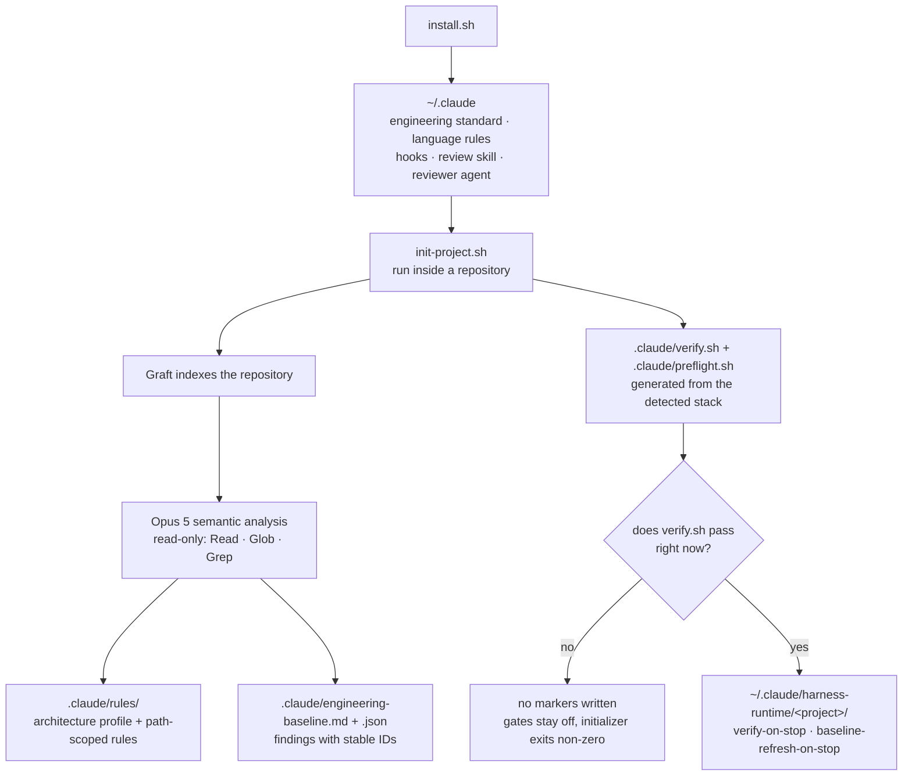
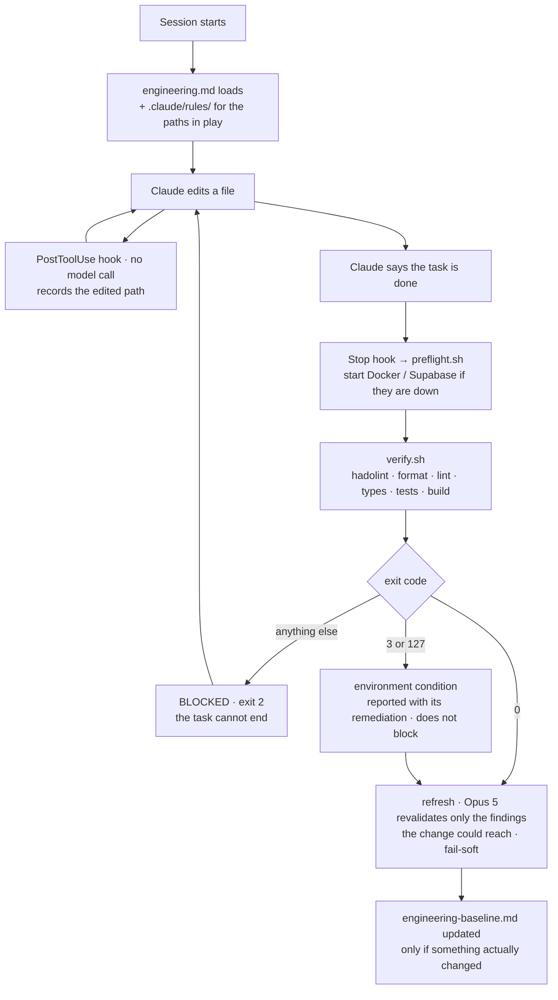
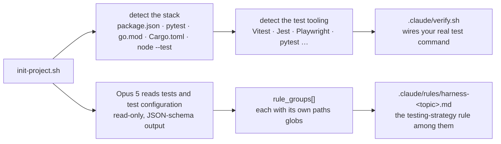
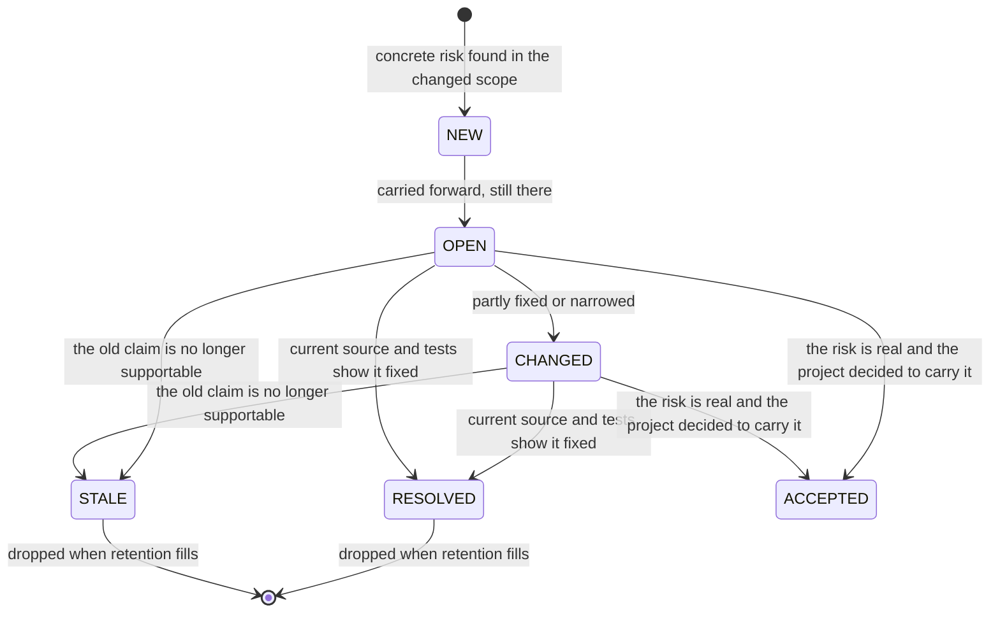

# Claude Engineering Harness

[English](README.md) · [Español](README.es.md)

### Your coding agent stops guessing, stops forgetting, and stops saying "done" without proof.

`claude-engineering-harness` is a personal Claude Code harness. It installs a fixed engineering
standard into every session, generates rules from a semantic read of your actual repository,
gates the end of every task on verification that really ran, and keeps a baseline of known risks
that ages with the code instead of going stale.

Personal tooling, built for my own projects. It installs globally into `~/.claude` and
initializes per repository.

---

## Contents

- [Origin](#origin)
- [Boundary](#boundary)
- [Quick start](#quick-start)
- [How the harness works](#how-the-harness-works)
- [The engineering principles, and why](#the-engineering-principles-and-why)
- [Tests](#tests)
- [What runs when](#what-runs-when)
- [What each generated file is for](#what-each-generated-file-is-for)
- [Consent](#consent)
- [What verification actually runs](#what-verification-actually-runs)
- [Starting a new project](#starting-a-new-project)
- [Baseline states](#baseline-states)
- [Graft and the harness](#graft-and-the-harness)
- [Repo layout](#repo-layout)
- [Cost](#cost)
- [Backups](#backups)
- [Uninstall](#uninstall)

---

## Origin

The quality of an agent's work is not only a property of the model. It is a property of the
harness around it: which context is loaded before it thinks, which rules sit in front of it while
it writes, and what has to pass before it is allowed to say the work is finished. The model is the
part you cannot change. The harness is the part you can.

Left to itself, a coding agent fails in four ways, and none of them is a failure of intelligence:

- **Blind.** It re-explores the repository from zero, one grep and one file at a time, rebuilding
  a picture it had an hour ago and threw away.
- **Forgetful.** A risk found on Tuesday is gone by Wednesday. Nothing carries across sessions, so
  the same weak spot is rediscovered, or silently reintroduced.
- **Unverified.** It finishes a task and tells you it is done. The lint never ran. The test suite
  never ran. The summary is confident, the diff is plausible, nothing checked it, and you find out
  later.
- **Disabled.** Docker was down, so the tests "failed", so the gate became noise, so you turned it
  off. Now nothing is checked at all.

A senior engineer holds a standard, remembers what is fragile, starts the database instead of
blaming it, and does not claim a check they skipped. The harness makes the agent do the same
mechanically, rather than hoping for it.

Everything below follows from that. The standard is fixed so it cannot be argued away. The rules
are read out of your repository so the advice is specific. The gate runs real commands so
"verified" means something. The baseline persists so memory survives the session. And an
unavailable tool is reported as an environment condition, because a gate that misdiagnoses is a
gate you delete — and a deleted gate checks nothing.

---

## Boundary

Four layers, with as little overlap as possible.

| Layer | Owns |
|---|---|
| **Claude Code** | The runtime: the model, the tools, the hook system, the session. |
| **Graft** | The repository map: symbols, callers, relationships, blast radius, freshness. *Where things are and what they touch.* |
| **This harness** | The engineering policy, the project-specific rules, the living baseline of risks, and the verification gate. *What good looks like, and whether you are done.* |
| **Your repository** | The code, and the scripts that verify it. `verify.sh` and `preflight.sh` are generated once and then yours to edit. |

The harness never writes your application code and never writes your tests. It decides what the
agent must know before writing them, and what must pass afterwards.

---

## Quick start

```bash
chmod +x install.sh
./install.sh                              # global standard, hooks, skill, agent
~/.claude/harness-tools/init-project.sh   # from inside any repo you want covered
```

That is the whole setup. `install.sh` writes the standard into `~/.claude` and wires two hooks
into your Claude Code settings. `init-project.sh` reads the repository, writes rules specific to
it, generates the baseline and the verification script, and switches the Stop gate on once it has
proven verification works. From the next session on, the harness rides along.

Restart Claude Code after installing. Rerun `init-project.sh` after upgrading the harness — it
regenerates the project files and keeps the existing baseline state.

Needs Node 20+ and npm for Graft. Git is optional — outside a repository the initializer uses the
current directory as the project root. Nothing is clobbered: the installer preserves unrelated
Claude Code configuration and backs up every file it touches under
`~/.claude/harness-backups/<timestamp>/`.

---

## How the harness works

Two phases. Installation and initialization happen once each; the session loop happens on every
task, forever.

### Install and initialize



The gate is only switched on for a project where verification has been observed to pass once. A
repository that cannot verify itself never receives a gate that would fail on every task.

### The session loop



The order is the point. Verification runs first and blocks on failure. The baseline refresh runs
second and never blocks: a failed refresh must not turn a good change into a failed task, so it
reports, exits 0, and leaves its dirty marker for the next Stop to retry.

---

## The engineering principles, and why

The core of the harness is `~/.claude/harness/engineering.md`, loaded into every session in every
directory. It is opinionated on purpose, and every rule in it exists because of a specific way
work goes wrong.

### 1. A fixed priority order for tradeoffs

```text
1. Correctness
2. Security and data integrity
3. Maintainability
4. Simplicity
5. Consistency with the existing architecture
6. Performance when supported by evidence
```

**Why.** Without a stated order, every tradeoff is re-litigated from scratch and resolved by
whatever was most recently discussed. Performance sits last deliberately: it is the one dimension
an agent will volunteer unprompted, it is the easiest to argue for with no measurement, and it is
the usual excuse for a clever construct nobody can maintain. It gets optimized when measured, not
when suspected.

### 2. Understand before changing

Read the implementation. Identify callers, dependencies, side effects, data flow. Never implement
from a filename or an assumption.

**Why.** The characteristic agent defect is a plausible change to the wrong layer — code that
matches the name of the file and not the contract inside it. **Enforced by** the generated
architecture profile, which describes real module boundaries and dependency direction, and by
Graft, which answers "who calls this" in one query instead of ten greps.

### 3. Explicit over clever, and the smallest coherent change

Keep responsibilities focused, dependencies explicit, coupling low. No hidden global mutable
state. No unnecessary abstractions. Names communicate intent. Comments record *why*, not what.

**Why.** An agent writes fluent code very quickly, which makes over-abstraction cheap to produce
and expensive to review. The constraint is not on how much code is written but on how much of it a
human has to hold in their head to approve it.

### 4. Design for failure, not for the happy path

Invalid input, missing or stale data, external service failures, timeouts, partial failures,
duplicate operations, retries, concurrency, race conditions, interrupted operations. Make invalid
states hard to represent. Bound every retry and every external wait. Never swallow an error in
silence.

**Why.** The happy path is the part that gets demonstrated, so it is the part that gets written.
Everything in that list is a real production incident that reads, in the diff, as an absence — and
an absence is what review misses.

### 5. Untrusted input at every boundary

Validate at boundaries. Authentication is not authorization. Least privilege. Parameterize
queries. No unsafe dynamic execution. Never log credentials or sensitive payloads. Sanitize errors
that cross a trust boundary. Review a dependency before adding it.

**Why.** Security defects are the cheapest class of bug to introduce and the most expensive to
find later, and they are invisible to a test suite that only asserts the feature works.
**Enforced by** the security-scoped generated rules, which name this repository's actual auth,
authorization and audit boundaries rather than restating the category.

### 6. Architectural scalability before infrastructure

Preserve module boundaries and contracts. Prefer stateless components. Keep infrastructure
replaceable behind a boundary. Avoid unnecessary microservices, queues, caches and distributed
coordination. Optimize measured bottlenecks.

**Why.** Adding infrastructure is the easiest-sounding answer to a scaling question and the one
with the largest permanent operational cost. A queue introduced speculatively is a new failure
mode, a new deployment, and a new thing to debug at 3am.

### 7. Scope discipline

No unrelated refactors. No speculative abstractions. No redesigning working architecture without a
concrete reason. No dependency for something the platform already does. Keep the diff reviewable.

**Why.** Scope creep is where agent work degrades fastest: the requested fix is correct and the
seventeen files around it are unreviewed. A diff nobody reads is a diff nobody caught anything in.

### 8. Test risk, not shape

Covered in full in [Tests](#tests).

### 9. The baseline is advisory, not authoritative

`.claude/engineering-baseline.md` is a living snapshot. Before acting on a finding, verify it
against current source and tests; prefer current implementation evidence when it conflicts with an
older finding.

**Why.** Persistent memory that is trusted blindly is worse than no memory. A finding written
three weeks ago may already be fixed, and an agent that "repairs" it will damage working code with
total confidence, citing the harness as its source.

### 10. An unavailable tool is an environment condition, not a defect

Exit `3` (nothing to verify) and exit `127` (missing command) are reported with their remediation
and do not block. Everything else means the checks ran and something is wrong, and that blocks.

**Why.** This is the rule that keeps the gate installed. Told to "fix the verification errors" on
every single Stop because Docker is not running, with no edit that could ever clear it, a
developer deletes the gate — and then nothing is checked at all. Before blaming the environment,
the preflight tries to start it; and it never resets or deletes a local database to recover from a
failed start, it stops and reports instead.

### 11. Finish honestly

Inspect the final diff. Run the formatter check, lint, type check, the relevant tests and the
build. Then review the diff as if another engineer had written it and you were approving it for
production. If a step could not run, state exactly what was not verified and why. Never claim a
change is verified when the checks were not actually run.

**Why.** This is the failure the whole harness exists for, and it is the one rule that cannot be
enforced by asking. **Enforced by** the Stop hook, which runs the commands itself and exits 2 on
failure. A claim in the summary is not evidence; an exit code is.

### 12. Report a finished change by naming the tests

Name every test added or changed and say what each one pins. Say plainly when a behaviour is
covered by no test. Where a regression test was written, state that it was confirmed to fail
before the fix. Report the counts last.

**Why.** "All 240 tests pass" is true in exactly the same way whether the new behaviour is
covered or not, so it carries no information about the change you are being asked to trust. The
list does; the count is context for the list, never a substitute for it.

The installer also pins the model and effort this work runs at:

```text
Model:  claude-opus-5
Effort: high
```

---

## Tests

The word covers three different things here, so it is worth separating them: what the harness
makes the agent *write*, what it *runs*, and what it proves about *itself*.

### 1. The harness does not write your tests. It constrains how they get written.

There is no test generator here, and that is deliberate: a test written by the same pass that
wrote the code tends to assert what the code does rather than what it should do, and it passes
before and after the bug. What the harness ships instead is policy that loads automatically the
moment Claude opens a test file.

`~/.claude/rules/harness-tests.md` declares its own scope in frontmatter:

```yaml
paths:
  - "**/*.test.*"
  - "**/*.spec.*"
  - "**/test/**"
  - "**/tests/**"
```

Claude Code loads it only for files matching those globs, so it costs nothing in a session that
touches no tests. What it demands:

- Test externally meaningful behaviour and invariants — not implementation details.
- Keep tests deterministic and independent of execution order.
- Avoid arbitrary sleeps and timing-sensitive assertions where deterministic synchronization is
  possible.
- Name each test after the behaviour or risk it protects.
- Prefer focused fixtures and builders over large opaque setup blocks.
- **A regression test must fail for the original bug and pass for the fix.**
- Do not mock the unit under test. Mock external boundaries only when it improves determinism
  without hiding the behaviour being validated.
- Never weaken or delete a valid test to make a change pass.

The global standard adds the risk ordering — business rules, edge cases, failure paths,
regressions, concurrency, important integrations — plus two rules that matter more than they look:
do not chase a coverage number without a risk-based reason, and **a new test must be shown to fail
against the unfixed code.** A test that passes both before and after is worse than no test,
because it reports coverage that does not exist.

### 2. How the project-specific test rules are generated

Generic test advice is nearly useless: the agent already knows tests should be deterministic. What
it does not know is *how this repository tests*. That part is read out of the repository during
`init-project.sh`:



The analysis prompt names "tests and test configuration" among the things it must inspect, and
states the goal explicitly: future agents should **write tests that match the repository's testing
strategy**. Output is forced through a JSON schema — 2 to 8 focused `rule_groups`, each declaring
the repository-relative globs it applies to — so the testing rule lands scoped to your test paths
rather than as prose in a wall of general advice. Two constraints keep it honest:

- **Verify claims against code.** The prompt forbids inventing conventions, and every rule must be
  specific enough to change an implementation decision in this repository.
- **Do not restate the global standard.** Anything already covered by `engineering.md` is excluded,
  so the generated rule is only what is true *here*.

Because the model's output reaches filenames and path globs, it is treated as untrusted input:
every path goes through path and glob sanitizers, and rule bodies are sanitized too — these files
are loaded as instructions in every future session.

### 3. What the harness runs

Verification executes the test command you already have, through the package manager from your
lockfile. It does not invent one, and it does not treat your suite as optional.

| Stack | The test step in the generated `verify.sh` |
|---|---|
| `package.json` | your `test` script; `typecheck` falls back to `test:types`; a pnpm monorepo falls back to `pnpm -r --if-present run` |
| Python | `pytest`, if installed |
| `go.mod` | `go test ./...` |
| `Cargo.toml` | `cargo test` |
| `*.test.mjs` with no manifest | `node --test`, for a repository that ships no `package.json` by design |
| none of those | a stub that exits 3 and asks you to customize it, rather than pretending to verify |

Steps you do not have are skipped, not faked. A project with only `lint` and `test` runs exactly
those two. Verification runs cheapest-first and stops at the first failure, so a formatting error
does not cost you a full build.

### 4. What the harness proves about itself

This repository is the harness, so a defect here does not break one project — it breaks every
project the harness is installed in, silently, because most of the failure modes are "a check that
never ran" rather than "a check that failed". Two shipped comments once claimed a test file
asserted something, for months, while the file did not exist.

So the suite tests the scripts as real subprocesses against a throwaway `HOME`, because the risk
they carry is what they do to a real config file on a real disk. **141 tests across 13 files**, no
dependencies, nothing but Node 20+ required:

```bash
node --test tests/*.test.mjs
```

| File | What it pins |
|---|---|
| `consent.test.mjs` | a cloned repository cannot enable the Stop gate on itself, its `verify.sh` and `preflight.sh` do not execute, and no shipped hook enables itself from a repository-controlled path |
| `payload.test.mjs` | a file added to any payload directory is really installed *and* really uninstalled, and the stock payload round-trips leaving nothing behind |
| `settings.test.mjs` | install applies the defaults and both hooks, is idempotent, and leaves unrelated settings and foreign hooks untouched |
| `hooks.test.mjs` | the PostToolUse case list and the refresh's grep filter agree on every path, and harness bookkeeping is ignored while real source is recorded |
| `init-project.test.mjs` | the generated `verify.sh` is a usable script, and a project with no usable scripts fails loudly instead of verifying nothing |
| `render.test.mjs` | the renderers refuse unstructured or incomplete model output, and escaping paths never reach evidence lines |
| `schemas.test.mjs` | both JSON schemas parse, survive the newline stripping their callers apply, are closed objects, and ask only for keys a renderer actually reads |
| `graft-evidence.test.mjs` | a graph that answers nothing is not reported as a successful integration |
| `stream-progress.test.mjs` | progress goes to stderr only, and a stream that ends without a result event is an error rather than a partial analysis rendered as a complete one |
| `rules.test.mjs` | every shipped rule is named so uninstall removes it, and every rule declares the paths it applies to |
| `defaults.test.mjs` | the hand-copied settings snippet applies exactly what the installer does, and claims nothing more |
| `version.test.mjs` | `VERSION` is the single source of the release string, and no shipped script restates it in prose |

CI runs the suite on Node 20, 22 and 24, on Linux and macOS, lints every shell script with a
pinned shellcheck, and runs one job under the real `/bin/bash` 3.2 — because the two most recent
shell regressions were macOS-only and one of them passed `bash -n` on the machine that shipped it.

---

## What runs when

Four things fire on their own. Nothing else needs running by hand.

**PostToolUse** fires on `Write`, `Edit`, `MultiEdit` and `NotebookEdit`, and records
repository-relative paths into `~/.claude/harness-runtime/<project>/`. It calls no model and
touches no code. It exists so the refresh knows the blast radius without guessing. It ignores its
own bookkeeping — edits to the baseline files, to `.claude/rules/`, to `verify.sh`, and to
`graft/`, `node_modules/`, `dist/`, `build/` and `coverage/` never mark the project dirty.

**The Stop hook** runs verify first and refresh second. Verification failure blocks the task.
Refresh failure is fail-soft, and the dirty state is kept so the next Stop retries.

It also distinguishes a broken change from a check it could not run. Exit `3` (no verification
strategy applies) and exit `127` (a required command is missing) are environment conditions:
reported on every Stop, with the command to fix them, and they do not block. Anything else means
the checks ran and something is genuinely wrong.

A session that verifiably changed nothing skips verification. "Changed nothing" means both a clean
working tree and no recorded edit — a task that edits files and then commits them leaves a clean
tree, and is still verified.

**The preflight** checks whether Docker is installed but stopped, whether `supabase/config.toml`
exists with the stack down, and whether the repo genuinely references Docker Compose — in
`package.json`, under `scripts/`, or in a root-level `*.sh` or `Makefile`. Both waits
are bounded and overridable:

```bash
HARNESS_DOCKER_WAIT_SECONDS=120
HARNESS_SUPABASE_WAIT_SECONDS=180
HARNESS_AUTO_INFRA=0 .claude/verify.sh   # check only, start nothing
```

It never resets or deletes a local database to recover from a failed start. It stops and reports
the environment problem instead.

`init-project.sh` is a one-shot command, so it records what the preflight started and stops it
afterwards, leaving the machine as it found it; a stack that was already running is never touched.
The Stop gate deliberately leaves it up — restarting Supabase before every task would cost far
more than the gate is worth — and says so, printing the command to stop it.

**The refresh** hands Opus 5 the current structured baseline plus Graft's change-impact context,
restricted to `Read`, `Glob` and `Grep`. It cannot edit. It is asked for two things and nothing
else: revalidate findings the change could plausibly have affected, and flag concrete new risks
inside the blast radius.

Every scripted model call the harness makes is read-only and non-persistent:
`--safe-mode --tools "Read,Glob,Grep" --disallowedTools "mcp__*" --permission-mode dontAsk
--no-session-persistence`, with a JSON schema on the output. The harness reads repositories; it
never lets a scripted call write one.

---

## What each generated file is for

### In your repository

Written by `init-project.sh`, except where noted.

| File | What it is |
|---|---|
| `CLAUDE.md` | Your project instructions. The harness updates only its own managed block and preserves everything else you wrote. |
| `.claude/rules/project-architecture.md` | The architecture profile Opus wrote after reading your repository: modules, boundaries, data flow, invariants. This is the file that makes advice specific instead of generic. |
| `.claude/rules/harness-*.md` | Conditional rules that load only for matching paths. Backend integrity, security boundaries, testing strategy, and whatever else the analysis judged this repo needs. |
| `.claude/engineering-baseline.md` | The human-readable list of known engineering risks, each with a stable ID and a state. This is the file you read. Retention is capped at 20 active and 15 resolved/stale findings, lowest severity dropped first, so it stays worth reading. |
| `.claude/engineering-baseline.json` | The same findings as machine state. It exists so a finding keeps its identity across refreshes instead of being rewritten as a new one every time. |
| `.claude/verify.sh` | The verification command for this project, generated from the stack it detected. Edit it freely — it is yours. |
| `.claude/preflight.sh` | Brings up local infrastructure before verification judges anything. Generated only if you do not already have one; a custom preflight is never overwritten, but it is not run until you approve it — see [Consent](#consent). |
| `.claude/auto-compose` | Optional, created by you. Its presence tells the preflight to bring up Docker Compose in a repo that does not otherwise reference it. |
| `.claude/settings.json` | Project-level Claude Code settings. |
| `.mcp.json`, `.claude/skills/graft/`, `.claude/helpers/` | Written by `graft init`, not by the harness. The harness backs them up first, then lets Graft own them. |

The two markers that enable the gates are **not** in the repository. They live in
`~/.claude/harness-runtime/<project>/`, written only by `init-project.sh` and only after that step
was proven to work once. See [Consent](#consent).

### Global, in `~/.claude`

| File | What it is |
|---|---|
| `harness/engineering.md` | The engineering standard itself. The single most important file in the repo. |
| `harness/project-analysis-prompt.md` + `.json` | The prompt and JSON schema for the initial repository analysis. The schema is what forces structured output instead of prose. |
| `harness/baseline-refresh-prompt.md` + `.json` | The same pair for the incremental refresh. |
| `harness/project-template/` | The `CLAUDE.md`, `verify.sh`, `preflight.sh` and architecture-rule skeletons that `init-project.sh` copies and fills in. |
| `rules/harness-*.md` | Rules that load automatically for matching file paths in any project: `typescript`, `react`, `tests`, `sql`, `http-api`, `jobs`, `config`, `shell`, `docker`, `ci`. Each declares its own path globs, so nothing loads where it does not apply. |
| `skills/harness-engineering-review/SKILL.md` | The review skill: a production-readiness pass over correctness, security, maintainability, scalability and test quality. |
| `agents/harness-engineering-code-reviewer.md` | A read-only reviewer agent that cannot edit, for an independent second opinion on a finished change. |
| `hooks/mark-baseline-dirty.sh` | The PostToolUse hook. Records edited files, calls no model. |
| `hooks/verify-project.sh` | The Stop hook. Runs preflight, verification, then refresh. |
| `harness-tools/` | `init-project.sh` and `refresh-baseline.sh`, plus the renderers that turn structured model output into Markdown, the progress reporter that makes the streamed analysis observable while it runs, and the settings helpers used by install and uninstall. |
| `harness-runtime/<project>/` | Per-project dirty state written by the PostToolUse hook and consumed by the refresh. Disposable. |
| `harness-state.json` | The `model` and `effortLevel` your `settings.json` had before the first install, so uninstall can put them back. Written once, never overwritten by a repeat install, deleted by uninstall. |

---

## Consent

The hooks are installed globally, so they fire in every repository you open — including one you
just cloned. Two harness steps execute scripts that live in the repository: the Stop gate runs
`.claude/verify.sh`, and initialization runs `.claude/preflight.sh`.

So permission to run them cannot come from the repository. It does not:

| Decision | Where it lives | Who can write it |
|---|---|---|
| Is the Stop gate on for this project? | `~/.claude/harness-runtime/<project>/verify-on-stop` | `init-project.sh`, after verification passed once |
| Is the baseline refresh on? | `~/.claude/harness-runtime/<project>/baseline-refresh-on-stop` | the same |
| May this repository's custom `preflight.sh` run? | `~/.claude/harness-runtime/<project>/preflight-approved` | you, via `--trust-preflight` |

What this means in practice:

```bash
git clone https://github.com/someone/their-project
cd their-project && claude          # ask anything: no harness script of theirs runs
```

Nothing of theirs executes, because you never enabled anything for that project. Run
`init-project.sh` there and the harness regenerates `verify.sh` from the stack it detects rather
than adopting theirs.

A `preflight.sh` is the one file the harness will not overwrite, because it may genuinely be
yours. If it was not generated by the harness, initialization keeps its contents and clears its
executable bit, which is what every execution path tests for, and tells you:

```
Preserved custom .claude/preflight.sh, but did NOT enable it.
  Read /path/to/.claude/preflight.sh, then approve it with:
    ~/.claude/harness-tools/init-project.sh --trust-preflight
```

The approval records that exact file. Edit it — or let a `git pull` change it — and it needs
approving again.

**Upgrading:** projects initialized before this used markers inside the repository. Those are no
longer honoured. The Stop hook says so and names the fix; rerun `init-project.sh` in each project
to re-grant it.

**What this does not cover:** once you have adopted a repository, its `verify.sh` is a script you
run, and a later `git pull` can change it. That is the same trust you extend to a `Makefile` or a
`package.json` script — the harness does not add a second layer over it.

---

## What verification actually runs

`init-project.sh` writes `.claude/verify.sh` from the stack it finds:

| Detected | What the generated script runs |
|---|---|
| `package.json` | Your real scripts, through the package manager from your lockfile. A pnpm monorepo falls back to `pnpm -r --if-present run` over lint, typecheck, test and build. |
| Python | `ruff check`, `mypy`, `pytest` — whichever are installed. |
| `go.mod` | `go vet ./...`, `go test ./...` |
| `Cargo.toml` | `cargo fmt --check`, `cargo clippy --all-targets --all-features -- -D warnings`, `cargo test` |
| `*.test.mjs` with no manifest | `node --test`. Checked after the manifests above, so a repository carrying both verifies as the stack it declares. |
| none of those | A stub that exits 3 and asks you to customize it, rather than pretending to verify. |

Independently of the stack, a repository containing a `Dockerfile` also gets linted with hadolint
before the stack checks run. Two decisions keep that gate usable rather than annoying:

- **A missing hadolint reports and continues.** An unavailable tool is not a code defect, and
  failing the build over it is how a gate gets switched off.
- **It fails at `warning` and above, not at hadolint's default of `info`.** The default fails a
  perfectly correct Dockerfile over advisory notes. Warnings still catch what matters — a `latest`
  base image, unpinned apt versions. Override with `HARNESS_HADOLINT_THRESHOLD`.

For a Node project it runs the strongest checks you already have, cheapest and non-mutating first,
stopping at the first failure:

```text
fmt:check       formatting
format:check    formatting, alternate script name
lint            static analysis
typecheck       falls back to test:types
test            your suite
build           last, most expensive
```

Every one of those is skipped when `package.json` has no such script. Nothing is invented and
nothing is guessed. A project with only `lint` and `test` runs exactly those two.

When nothing can be detected, the stub fails loudly instead of passing. That is deliberate.
Silently verifying nothing is worse than saying it cannot.

---

## Starting a new project

`init-project.sh` analyzes a repository and gates on verifying it, so it needs something to
analyze. On an empty directory it degrades honestly rather than pretending:

1. Graft builds a near-empty graph, and the semantic analysis has almost nothing to describe.
2. No stack is detected, so `verify.sh` is the stub that exits 3.
3. Verification fails, so **neither marker is written** — the Stop gate and the living baseline
   both stay off.
4. The initializer exits non-zero, telling you exactly that.

That is the design working. A repository where verification cannot pass never gets a gate that
would fail on every task.

**You do not need any of that to start.** The standard, the language rules, the review skill and
the reviewer agent are global: `install.sh` puts them in `~/.claude` and they apply to every
session in every directory, initialized or not. A brand-new project already gets the engineering
standard from the first prompt.

The sequence that works:

```bash
./install.sh                              # once, ever
# ... scaffold the project: package.json, scripts, one passing test ...
git init && git add -A && git commit -m "initial"
~/.claude/harness-tools/init-project.sh   # now there is something to analyze
```

Run it once the project has a `test` or `lint` script that passes and enough code to describe.
Before that point the project layer has nothing to say, and the global layer is already covering
you.

If you want the project files in place early anyway, `--skip-verify` configures everything and
leaves the gates off by design. Rerun without it once the project can verify itself.

---

## Baseline states

Findings get stable IDs — `F001`, `F002`, `F003` — and a state that moves as the code does.



```text
Before
[OPEN] HIGH — Health endpoint returns 200 while degraded · F001

After a verified fix
[RESOLVED] HIGH — Health endpoint returns 200 while degraded · F001
```

### The rating is computed, not asked for

The model does not choose `CRITICAL` or `LOW`. It reports three facts and the harness derives the
level from a table, so the same finding rates the same way on every run and two projects' ratings
mean the same thing.

| Axis | Values |
|---|---|
| `impact` | `data_loss` · `security` · `incorrect_result` · `maintenance` · `cosmetic` |
| `trigger` | `already_occurring` · `normal_use` · `specific_conditions` · `hypothetical` |
| `blast_radius` | `system_wide` (raises one level) · `component` · `local` (lowers one) |

`trigger` is about the harm, not the code path: a global install at `@latest` runs every time, but
the harm needs a bad version published first, so it is `hypothetical`. Only the table produces a
`critical`; the blast-radius modifier can never create one, or a harness that is system-wide by
nature would inflate every latent risk it has to the top level.

Each rendered finding carries the axes it was rated from, so you can argue with the inputs rather
than the verdict, and a finding whose axes never arrived reads `NOT MEASURED` rather than `LOW`.

`ACCEPTED` exists so that a risk you have decided to carry is recorded as a decision instead of
being expressed by quietly understating the axes. The rating states the risk; the status states the
decision.


The identity is the point. Findings live in a JSON file next to the Markdown precisely so `F001`
stays `F001` across refreshes, instead of being rewritten as a brand-new finding every time and
losing the fact that you already looked at it.

The baseline is advisory, not authoritative. The standard tells Claude to verify a finding against
current source and tests before acting on it, because a finding written three weeks ago may
already be fixed.

Refresh maintains findings, not the architecture model. If Opus decides a task materially changed
the architecture, the baseline records `Full harness reanalysis recommended` and you rerun
`init-project.sh`. That split is why an ordinary feature never pays for a full repository
analysis.

Absence is never rendered as a favourable default. A dimension that was not measured says "not
measured", and if a truncation, a cap or a skipped step changed what the model saw, the artifact
says so — a degraded run must not read like a grounded one.

---

## Graft and the harness

Two layers, no overlap:

```text
Graft                        Harness
  repository map               engineering policy
  symbols                      project-specific rules
  callers                      business invariants
  relationships                living findings
  blast radius                 verification
  freshness
```

Graft answers *where things are and what they touch*. The harness decides *what good looks like
and whether you are done*. Claude Code uses both.

Graft evidence accelerates navigation. Critical security, correctness, business-rule and mutation
decisions still get verified against source — the standard says so explicitly.

The integration reports the evidence it actually obtained, not the fact that wiring ran: the
status is `indexed` or `wired-but-empty`, and both the analysis prompt and the run summary state
whether the repository map was empty and how many structural queries returned anything. A
groundless analysis must not read like a grounded one.

On install and on project init, the harness asks npm whether there is a newer Graft and upgrades
only when the registry is ahead. It will not downgrade a local build that is newer than npm
latest.

---

## Repo layout

```text
install.sh                     global install: payload, hooks, settings defaults
uninstall.sh                   the exact inverse, derived from the same tree
VERSION                        single source of the release string

src/
├── harness/                   engineering.md + the two prompt/schema pairs
├── rules/                     harness-*.md language and area rules
├── hooks/                     mark-baseline-dirty.sh · verify-project.sh
├── skills/                    harness-engineering-review
└── agents/                    harness-engineering-code-reviewer

project-template/              CLAUDE.md · verify.sh · preflight.sh · architecture rule
tools/                         init-project.sh · refresh-baseline.sh · renderers · settings I/O
tests/                         141 tests, node:test, no dependencies
```

`src/`, `project-template/` and `tools/` are the installable payload. Both `install.sh` and
`uninstall.sh` derive what they touch from the tree rather than from a hardcoded list, and
`tests/payload.test.mjs` proves it by adding a file to every payload directory and round-tripping
it — a file that is committed, reviewed and documented but silently never copied is a failure mode
this repository has actually had.

There are no dependencies, no `package.json` and no lockfile. Node tools are ESM `.mjs` using
`node:` builtins only; shell is POSIX and Bash 3.2 compatible, because macOS still ships
`/bin/bash` 3.2. The harness installs into a home directory: anything it needs at runtime must
already be on the machine.

---

## Cost

`init-project.sh` is the expensive call. It reads the repository deeply, once.

After that, at most one incremental baseline analysis per coding task, and only when the task
actually edited relevant files. Several edits in one task collapse into a single refresh. A task
that edited nothing relevant makes no model call at all.

---

## Backups

Nothing is overwritten without a copy first, and no write is done in place: the harness writes a
temp file and renames it over the target, so an interrupted write cannot truncate what was there.

```text
~/.claude/harness-backups/            global installation
~/.claude/harness-project-backups/    project initialization
~/.claude/harness-baseline-backups/   living-baseline updates
~/.claude/harness-project-analysis/   structured analysis archives
```

Under `~/.claude`, the harness only ever creates, prunes or removes files matching `harness-*` in
`rules/`, `agents/` and `skills/`. Those directories are yours too.

---

## Uninstall

```bash
./uninstall.sh
```

Removes the harness's own global files and hooks, and restores the model and effort settings you
had before the first install. Backup directories are preserved. Graft is left installed.

---

## License

MIT. See [LICENSE](LICENSE).
